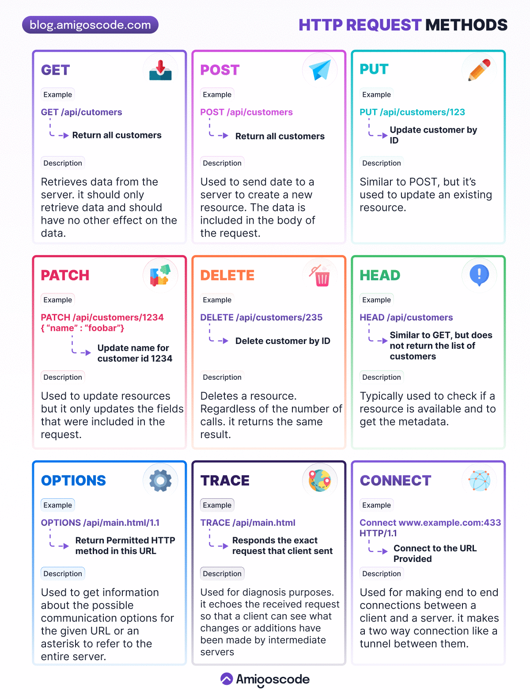

## Http

### Http Methods

- GET : Retrieve information from the server. Should not modify the data on the server. It can be cached, bookmarked, and may remain in the browser history.

- PUT : Replace or update an existing resource on the server. May change server status. It cannot be cached, bookmarked, and not stored in browser history.

- POST : Send data to the server, including images, JSON strings, file downloads, etc. It cannot be cached, bookmarked, and not stored in the browser history.

- DELETE : Delete a resource from the server. May change server status. It cannot be cached, bookmarked, and not stored in browser history.

- PATCH : Partially modify the specified resource on the server. It is faster and requires less resources than the PUT method. It cannot be cached, bookmarked, and not stored in browser history.

- HEAD : Similar to GET, except it transfers the status line and headers only. Should not modify the data on the server. It cannot be bookmarked and does not remain in the browser history.

- CONNECT : Establishes two-way communication with the server by creating an HTTP tunnel through a proxy server.

- OPTIONS : Used by browsers for CORS operations. Describes the communication options available for the requested resource. Does not change data on the server. It cannot be cached, bookmarked, and not stored in browser history.

- TRACE : It is designed for diagnostic purposes. When used, the web server sends back to the client the exact request that was received.

